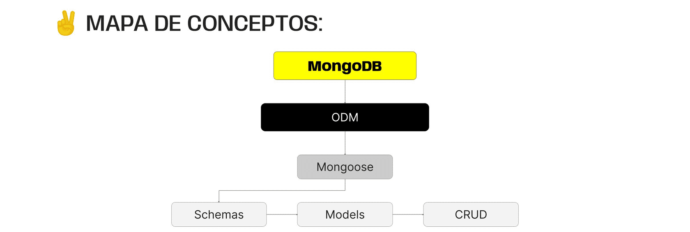

# Mongoose

## ¿Qué es un ODM?

Son librerias que nos permiten manipular y convertir datos que son incompatibles, ya que el servidor y la base de datos utilizan formatos distintos. Se puede trabajar con la base de datos sin necesidad de cambiar el lenguaje.

Existen muchos ODMs, dependiendo de la base de datos. En MongoDB utilizaremos mongoose.

## ¿Qué es?
Biblioteca creada para modelado de objetos de mongoDB con node, podemos trabajar con javascript y typescipt.

## Schemas y Models

### Schemas
Un schema es un objeto que podemos crear en nuestro código, el cuál lleva la configuración de una colección.

Primero debemos pensar que información quisiéramos guardar. Por ejemplo si pensamos en un usuario necesita su nombre que es un string, edad que es un number, email que debe ser unico, entre otros.

.png)

### Modelos
Un modelo es un objeto basado en un Schema, lo que nos permite interactuar con una colección en MongoDB. Nos ayudara a realizar las operaciones CRUD. En otras palabras el modelo utilizará la plantilla creada por el schema para poder modificar la base de datos.

para crear el modelo vamos a crear una variable user y usar el metodo model de mongoose, este tomara dos argumentos. Primero el nombre del modelo y segundo sera el schema que creamos anteriormente

.png)

En resumen ambas estructuras necesitan una de la otra para poder funcionar

- El schema define la estructura de los documentos
- El modelo utiliza el schema para proporcionar un objeto para interactuar con la base de datos.

