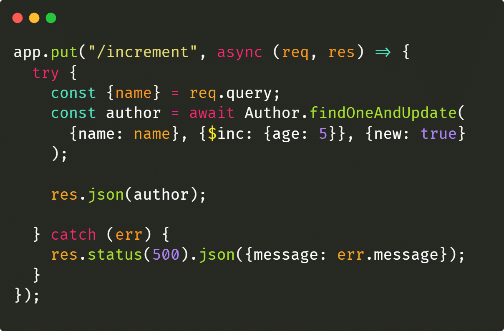
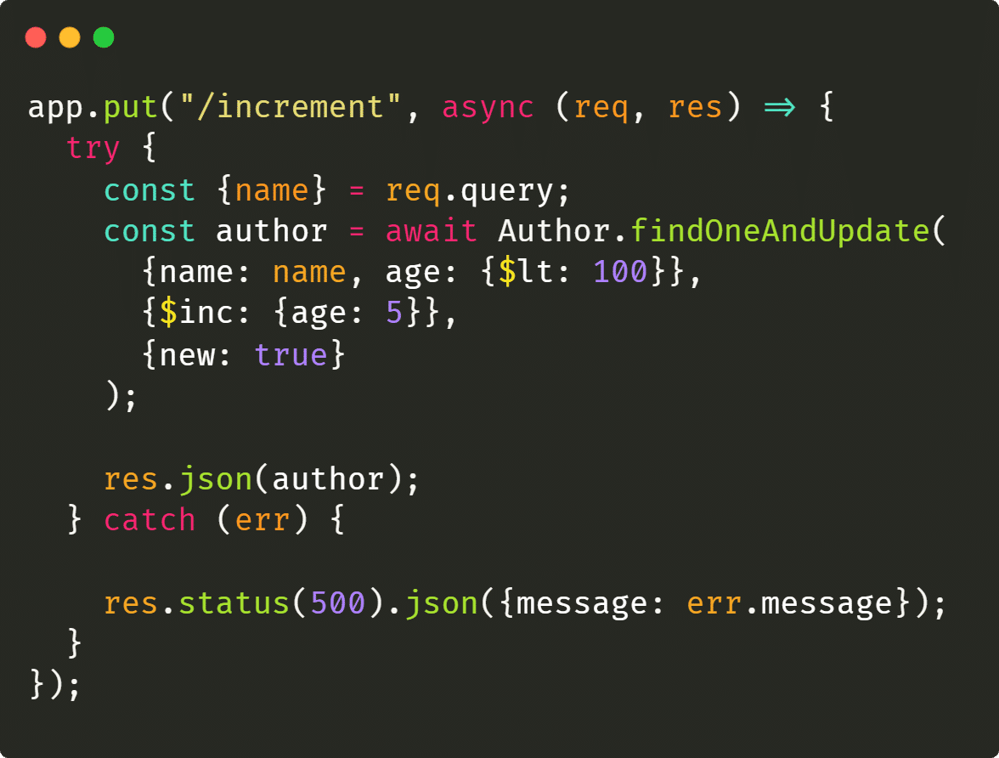
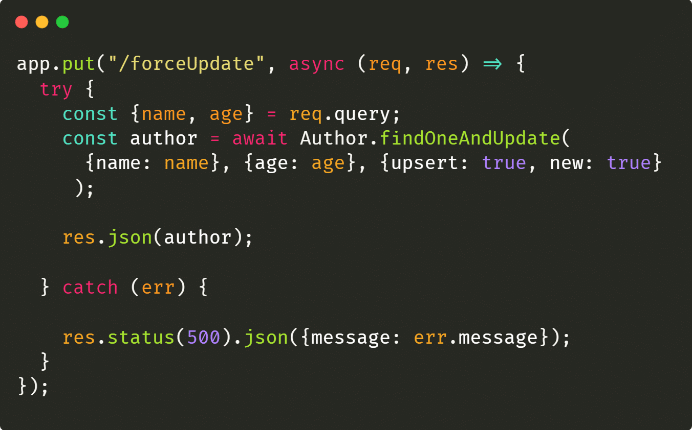
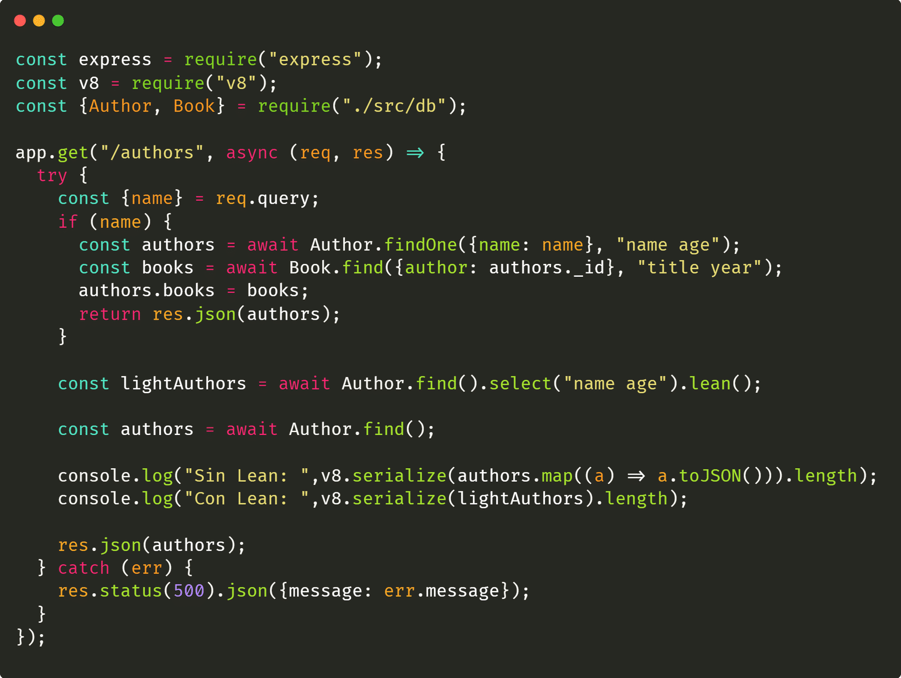
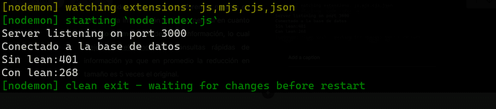
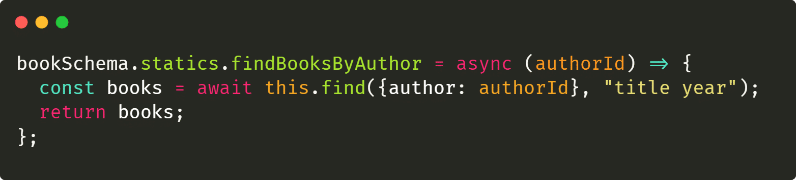
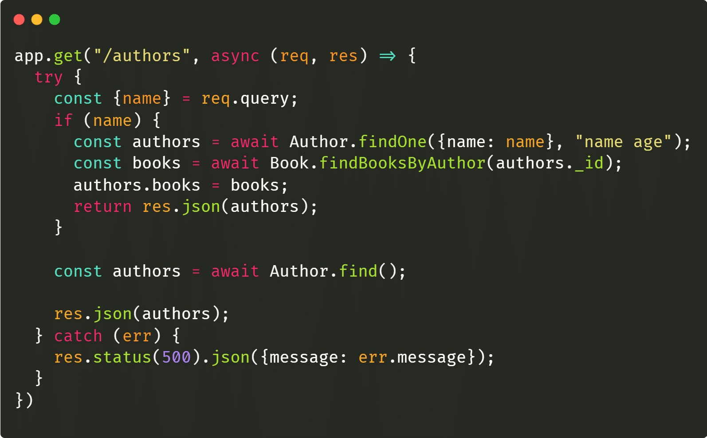
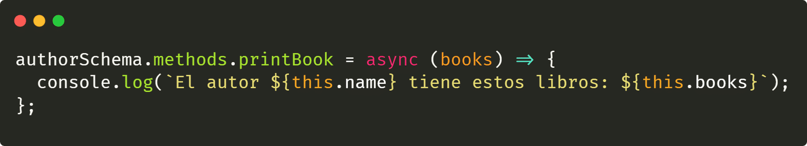
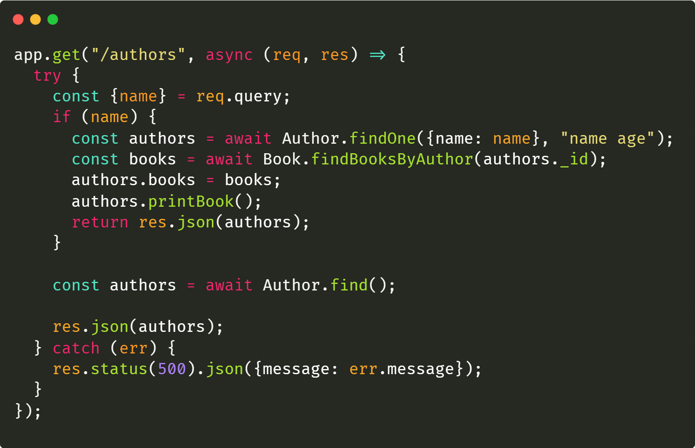
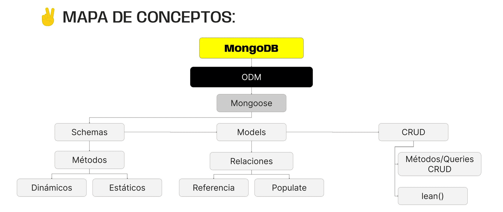

# Mongoose II

## Queries
Una query es una solicitud especifica a la base de datos, utilizada para buscar,crear, actualizar y eliminar datos. En otras palabras es una instrucción para realizar una acción a la base de datos.

### Actualizacion por operadores
Podemos actualizar un documentos por medio de operadores de comparación en lugar que lo haga el cliente. Los operadores de comparación son códigos que nos permite realizar una comparacióm de datos con una condición especifica.

Para actualizar debemos crear una ruta put que reciba la información que queremos actualizar. Podemos utilizar el metodo de mongoose **findOneAndUpdate()** donde le pasamos por argumentos el dato para buscar el documento que vamos a actualizar y como despues el operador **($inc)** para modificar el valor, finalmente podemos indicar que devuelva el objeto actualizado.

En este ejemplo buscamos al autor por el nombre para incrementar la edad.

### Actualizar con validación
Podemos realizar diferentes metodos para validar la información enviada en este ejemplo se utiliza el metodo **$lt** para asegurar que el incremento de edad solo sea posible si es menor a 100.
Si la edad del documento cumple con la condición se realizara la actualización.

### Actualizar o crear
Podemos utilizar el método **findAndUpdate()** que va a forzar una actualizacion y si no hay nada para actualizar, se creara. Esta acción es conocida como upsert

## Referencia
Cuando trabajamos con MongoDB podemos combinar datos de diferentes colecciones. Esta relación se generan por referencia, en lugar de almacenar toda la información en un solo documento, almacenamos una referencia al documento

## Populate
La populación es una tecnica que nos permite reemplazar referencias en documentos. Podemos acceder a información de otras colecciones que están relacionadas para obtener los detalles completos de esa colección. Debemos encadenar el metodo **populate()** para obtener los datos del documento

## Mongoose Tips & Tricks

### Metodo Lean
Nos permiten obtener objetos simples de JavaScript en vez de isntancias completas de modelos.

Esto puede ser util si solo queremos datos livianos y no vamos a modificar ni guardarlos.

En este ejemplo utilizamos buscamos información con y sin el metodo **lean()** para realizar una comparación del tamaño de bits de la respuesta

Aunque este metodo no genera una diferencia notable al recibir la información, si lo hace en el peso de memoria, mejorando la eficiencia y poder tener consultas más rapidas.

### Métodos estáticos y dinámicos
Son métodos que actúan como funciones personalizadas en los modelos.

1. Metodo Estáticos: Son funciones que aplicamos directamente al modelo y no a la instancia. útiles para realizar operaciones que afectan a toda la colección y que no se vincule a ningún documento en especifico, En este ejemplo crearemos una funcion estatica para buscar un autor mediante el id:

+ **creacion:** para poder crearlo debemos utilizar el metodo **statics** del schema y luego generar la función

+ **Uso:** Esto nos permite usar el método dentro del modelo y realizar el funcionamiento

2. Metodos Dinámicos: Son metodos que se aplican a instancias especificas del modelo. Utiles para realizar operaciones en documentos individuales, sin afectar a los demás.

+ **creacion:** Para crearlo debemos utilizar la propiedad **methods** del schema al que queremos asociar. Podemos utilizar la palabra clave this para acceder a los valores de la instancia sobre la cual estamos trabajando.

+ **Uso:** Nos permite utilizar este metodo una vez creada la instancia.

## Mapa de conceptos
